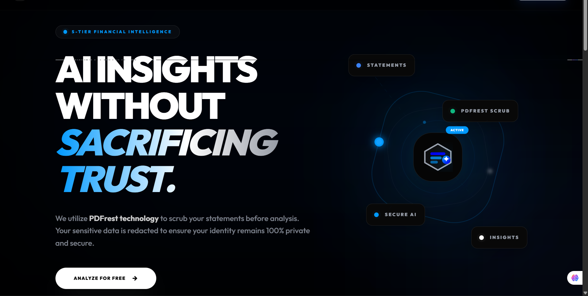

# Bank Statement Analyser

A comprehensive full-stack web application designed to automatically parse, redact, and analyse bank statement PDFs. By leveraging dual-layer personally identifiable information (PII) redaction and local AI-generated financial insights via Ollama (LLaMA 3), the platform provides secure, actionable intelligence on personal or business finances.

## 🎯 What Problem Does This Solve?
Analyzing bank statements manually is a tedious, error-prone, and time-consuming process. While AI makes extracting insights easier, uploading unredacted financial documents to third-party cloud services poses significant privacy and security risks.

**Bank Statement Analyser** solves this by:
1. **Ensuring Absolute Privacy**: Operating a dual-layer redaction pipeline. PII is redacted *client-side* in the browser before ever reaching the server. A secondary server-side pass ensures no sensitive strings slip through before the data touches the LLM.
2. **Automating Financial Insights**: Replacing manual spreadsheet data entry with an automated AI pipeline that categorises spending, identifies recurring transactions, flags unusual activity, and calculates net balances.
3. **Keeping AI Local (or Controlled)**: Using Ollama (LLaMA 3) to perform the actual statement analysis, giving users the flexibility to keep their most sensitive financial analyses completely off big-tech cloud providers.

## 🚀 Key Features
- **Secure PDF Upload & Parsing**: Extracts text and bounding boxes from uploaded statements.
- **Dual-Layer PII Redaction**: 
  - *Client-side*: Uses `@openredaction/openredaction` and `pdf-lib` to visually redact and remove PII from the PDF canvas in-browser.
  - *Server-side*: Uses Microsoft Presidio for a secondary pass on extracted text.
- **AI-Powered Financial Analysis**: Generates structured JSON insights (spending by category, recurring transactions, anomalies, etc.) utilizing LLaMA 3.
- **Rich Dashboard & Visualizations**: Interactive Vue 3 frontend utilizing Apache ECharts to display donut charts, income vs. expense breakdowns, and merchant analyses.
- **Export Capabilities**: Download your secure, categorized insights as a stylised PDF, Excel workbook, or raw JSON.
- **Robust Authentication & Tagging**: Secure JWT-based auth, user-specific statement tagging, and filtering.

## 🛠 Tech Stack

### Frontend
- **Framework**: Vue 3 (Composition API) + Vite
- **UI & Styling**: Tailwind CSS 3, PrimeVue 4
- **State & Routing**: Pinia, Vue Router 4
- **PDF & Canvas**: pdfjs-dist, pdf-lib, `@openredaction/openredaction`
- **Charts**: Apache ECharts (`vue-echarts`)

### Backend
- **Framework**: FastAPI (Python 3.11+)
- **Database**: PostgreSQL 15 + SQLAlchemy 2.0 (Async) + Alembic
- **Task Queue**: Celery + Redis for async PDF processing
- **AI / LLM**: Ollama Python SDK (LLaMA 3)
- **Redaction**: Microsoft Presidio (Analyzer + Anonymizer), `pdfplumber`, `PyMuPDF`
- **Security**: JWT (`python-jose`), bcrypt

*For more in-depth technical details, please view the [Backend Specification](Specification-docs/BE.md) and [Frontend Specification](Specification-docs/FE.md).*

## 🏗 Project Structure

```text
bank-analyser/
├── be/                 # FastAPI backend, Celery workers, and Python services
├── fe/                 # Vue 3 Vite application
├── Specification-docs/ # Detailed BE and FE architectural documentation
└── README.md
```

## 🏁 Quick Start

### Prerequisites
- Node.js 20+
- Python 3.11+, `uv` installed
- Docker + Docker Compose (for Postgres and Redis)
- [Ollama](https://ollama.ai) running locally or accessible as a cloud API (with `llama3` model pulled: `ollama run llama3`)

### Backend Setup

```bash
cd be
# Copy environment variables
cp .env.example .env
# Ensure you configure DATABASE_URL, REDIS_URL, etc., in .env

# Create virtual environment and install dependencies
uv venv
source .venv/bin/activate  # On Windows use: .venv\Scripts\activate
uv pip install -e .

# Run the FastAPI server
uvicorn app.main:app --reload
```

*Make sure to run Alembic migrations (`alembic upgrade head`) and start Celery workers if processing background jobs.*

### Frontend Setup

```bash
cd fe
# Copy environment variables
cp .env.example .env
# Edit to point VITE_API_BASE_URL to your backend if different from default

# Install and run
npm install
npm run dev
```

## 📚 API Documentation

Once the backend is running, an OpenAPI (Swagger) UI is automatically generated. Visit:
[`http://localhost:8000/api/v1/openapi.json`](http://localhost:8000/api/v1/openapi.json) or [`http://localhost:8000/docs`](http://localhost:8000/docs) to easily explore and test API endpoints.
